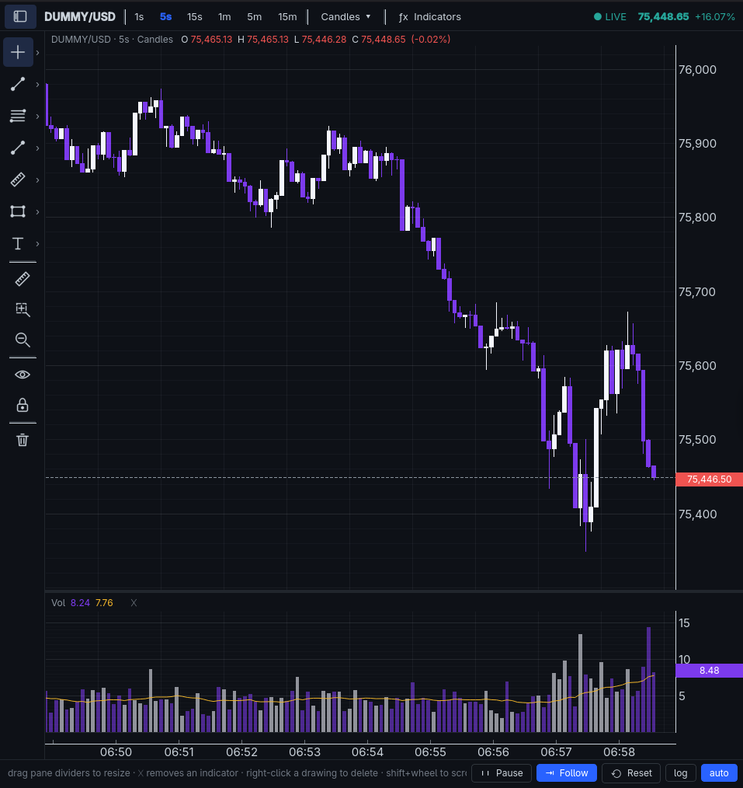
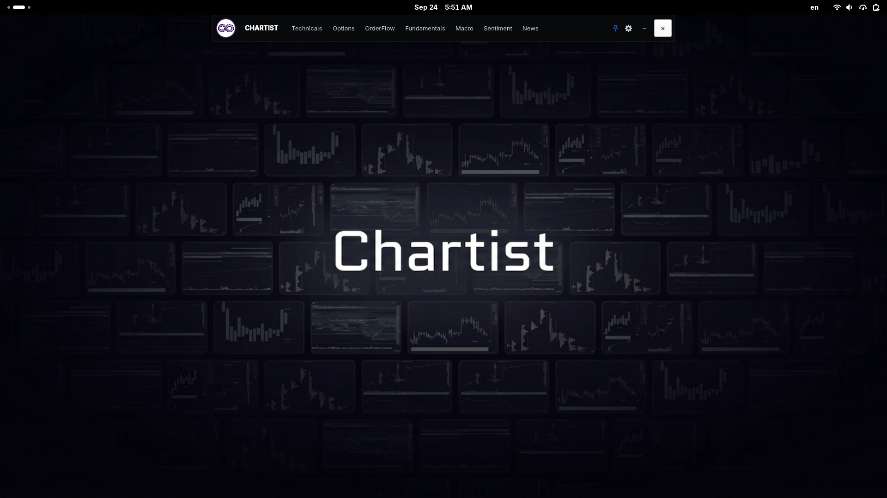

<div align="center">

# Chartist

**A modular desktop workspace for technical analysis and market research.**

Built with Python, PyQt6, pyqtgraph, and NumPy.

[Features](#features) · [Screenshots](#screenshots) · [Quick Start](#quick-start)

</div>

---

## Features

- TradingView-style candles, indicators, linked panes, and drawing tools
- Candles, bars, line, area, Heikin-Ashi, and synthetic footprint views
- Compact launcher and multi-tab workspace mode
- Standalone pages: Technical Analysis, Options, Order Flow, Fundamentals, Macro, Sentiment, OnChain, and News
- Fast ticker search from the symbol chip or by typing on a chart
- Settings window, profile avatar, and pinned launcher
- Cross-platform setup through `uv`

### Options

- Subtabs: **Chain**, **Volatility**, **Surfaces**, **Heatmap**, **Clusters**, **Strategies**
- Simulated option chain with Greeks, IV smile, 3D metric surfaces (Bloomberg-style axis planes), heatmap, clusters, and strategy payoffs

### Order Book / Flow

- Subtabs: **Orderbook**, **Orderflow**, **Depth**, **Tape**
- Exchange selector on the book (default **Aggregated**, plus NASDAQ / NYSE / ARCA / BATS / IEX)
- Demo L2 ladder (normal-shaped live depth), Technicals-style Orderflow chart (Footprint / Heatmap + Delta / CVD), depth chart, and time & sales

### Macro

- World choropleth map with searchable indicators and country sidebar
- Year timeline (1914–2026) with TradingView-style metric color scale
- **2D / 3D** view toggle with dropdowns for projection, surface, and height
  - Flat 3D continuous surface or country tiles
  - Realistic textured **Globe** (NASA Earth map) with metric overlays
- Simulated macro series for demo use

### Sentiment

- Subtabs: **Gauge**, **Indicators**, **Socials**, **Mentions**, **Backtest**
- Fear & Greed dial (very slow live pulse) with component bars and history
- Broad sentiment / internals indicator grid (A/D, MAs, VIX, TRIN, AAII, COT, flows, …)
- **Socials**: overall posts sentiment with platform (X, Reddit, …) + asset filters and an F&G-style time series
- **Mentions**: ticker buzz board (bullish %, mentions, leaders)
- **Backtest**: price chart (top bar: symbol / TF / candle style only) — drag a region to see posts & sentiment in that window

### OnChain

- Subtabs: **Overview**, **Indicators**, **Flows**, **Graph**, **Trades**
- Networks: BTC, ETH, SOL, Base, Arbitrum
- On-chain KPIs and indicators (active addresses, SOPR/MVRV, exchange flows, hashrate, …)
- Whale / exchange transfer tape
- Wallet relationship graph + cluster correlation heatmap
- Trade graph with large-transfer USD bars

### News

- RSS/Atom headlines with category filtering and article detail pane

## Screenshots

### Technical Analysis workspace



### Compact launcher - Inspiration from Deepcharts.



## Quick Start

```bash
git clone https://github.com/MwkosP/Chartist.git
cd Chartist
uv sync
uv run chartist
```

Requires Python 3.10+ and [uv](https://docs.astral.sh/uv/).

## Development

Run the test suite:

```bash
uv run python -m unittest discover -v
```

> [!NOTE]
> Chartist currently uses simulated market and macro data. Footprint bid/ask values are synthetic until a real trade-level feed is connected.

---

<div align="center">

Early-stage project — interfaces and APIs may change.

</div>
